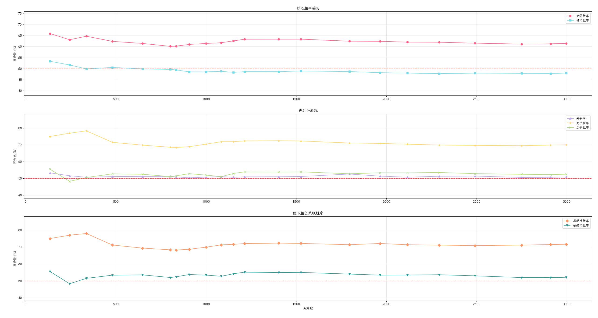
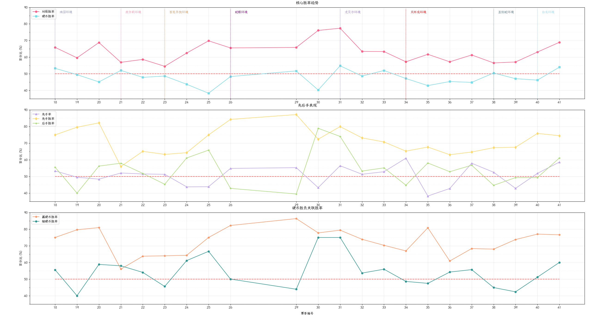
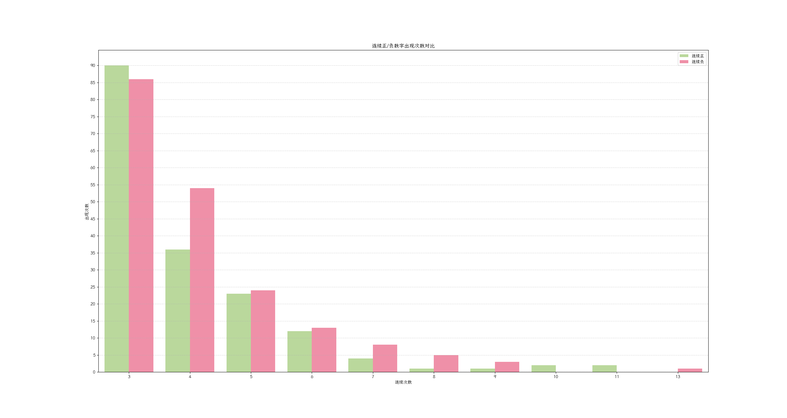

# 22个赛季3000场对局数据汇总

## 全部赛季数据累计统计
| 赛季  | 总对局数 | 胜场数  | 胜率(%) | 硬币胜场 | 硬币胜率(%) | 先手次数 | 先手率(%) | 先手胜场 | 先手胜率(%) | 后手胜场 | 后手胜率(%) | 赢硬币胜场 | 赢硬币胜率(%) | 输硬币胜场 | 输硬币胜率(%) |
| --- | ---- | ---- | ----- | ---- | ------- | ---- | ------ | ---- | ------- | ---- | ------- | ----- | -------- | ----- | -------- |
| 18  | 135  | 89   | 65.93 | 72   | 53.33   | 72   | 53.33  | 54   | 75.0    | 35   | 55.56   | 54    | 75.0     | 35    | 55.56    |
| 19  | 244  | 154  | 63.11 | 126  | 51.64   | 126  | 51.64  | 97   | 76.98   | 57   | 48.31   | 97    | 76.98    | 57    | 48.31    |
| 20  | 337  | 218  | 64.69 | 168  | 49.85   | 171  | 50.74  | 134  | 78.36   | 84   | 50.6    | 131   | 77.98    | 87    | 51.48    |
| 21  | 481  | 300  | 62.37 | 243  | 50.52   | 246  | 51.14  | 176  | 71.54   | 124  | 52.77   | 173   | 71.19    | 127   | 53.36    |
| 22  | 648  | 398  | 61.42 | 323  | 49.85   | 332  | 51.23  | 232  | 69.88   | 166  | 52.53   | 224   | 69.35    | 174   | 53.54    |
| 23  | 802  | 482  | 60.1  | 398  | 49.63   | 411  | 51.25  | 282  | 68.61   | 200  | 51.15   | 272   | 68.34    | 210   | 51.98    |
| 24  | 834  | 502  | 60.19 | 412  | 49.4    | 425  | 50.96  | 291  | 68.47   | 211  | 51.59   | 281   | 68.2     | 221   | 52.37    |
| 25  | 907  | 553  | 60.97 | 440  | 48.51   | 457  | 50.39  | 315  | 68.93   | 238  | 52.89   | 302   | 68.64    | 251   | 53.75    |
| 26  | 1000 | 614  | 61.4  | 485  | 48.5    | 508  | 50.8   | 358  | 70.47   | 256  | 52.03   | 339   | 69.9     | 275   | 53.4     |
| 29  | 1085 | 670  | 61.75 | 529  | 48.76   | 555  | 51.15  | 399  | 71.89   | 271  | 51.13   | 377   | 71.27    | 293   | 52.7     |
| 30  | 1152 | 721  | 62.59 | 556  | 48.26   | 584  | 50.69  | 420  | 71.92   | 301  | 52.99   | 398   | 71.58    | 323   | 54.19    |
| 31  | 1214 | 769  | 63.34 | 590  | 48.6    | 619  | 50.99  | 448  | 72.37   | 321  | 53.95   | 425   | 72.03    | 344   | 55.13    |
| 32  | 1403 | 889  | 63.36 | 682  | 48.61   | 716  | 51.03  | 519  | 72.49   | 370  | 53.86   | 493   | 72.29    | 396   | 54.92    |
| 33  | 1526 | 967  | 63.37 | 746  | 48.89   | 781  | 51.18  | 565  | 72.34   | 402  | 53.96   | 538   | 72.12    | 429   | 55.0     |
| 34  | 1795 | 1121 | 62.45 | 873  | 48.64   | 945  | 52.65  | 672  | 71.11   | 449  | 52.82   | 623   | 71.36    | 498   | 54.01    |
| 35  | 1965 | 1226 | 62.39 | 946  | 48.14   | 1010 | 51.4   | 716  | 70.89   | 510  | 53.4    | 682   | 72.09    | 544   | 53.39    |
| 36  | 2117 | 1313 | 62.02 | 1015 | 47.95   | 1075 | 50.78  | 757  | 70.42   | 556  | 53.36   | 724   | 71.33    | 589   | 53.45    |
| 37  | 2293 | 1421 | 61.97 | 1094 | 47.71   | 1177 | 51.33  | 823  | 69.92   | 598  | 53.58   | 778   | 71.12    | 643   | 53.63    |
| 38  | 2491 | 1533 | 61.54 | 1194 | 47.93   | 1281 | 51.43  | 893  | 69.71   | 640  | 52.89   | 846   | 70.85    | 687   | 52.97    |
| 39  | 2750 | 1681 | 61.13 | 1316 | 47.85   | 1392 | 50.62  | 968  | 69.54   | 713  | 52.5    | 936   | 71.12    | 745   | 51.95    |
| 40  | 2910 | 1782 | 61.24 | 1390 | 47.77   | 1475 | 50.69  | 1031 | 69.9    | 751  | 52.33   | 993   | 71.44    | 789   | 51.91    |
| 41  | 2997 | 1842 | 61.46 | 1437 | 47.95   | 1526 | 50.92  | 1069 | 70.05   | 773  | 52.55   | 1029  | 71.61    | 813   | 52.12    |

## 赛季累计胜率变化

## 各赛季胜率数据
| 赛季 | 总对局 | 胜率% | 硬币胜率% | 先手率% | 先手胜率% | 后手胜率% | 赢硬币胜率% | 输硬币胜率% |
|------|--------|-------|-----------|---------|-----------|-----------|-------------|-------------|
| 18 | 135 | 65.9 | 53.3 | 53.3 | 75.0 | 55.6 | 75.0 | 55.6 |
| 19 | 109 | 59.6 | 49.5 | 49.5 | 79.6 | 40.0 | 79.6 | 40.0 |
| 20 | 93 | 68.8 | 45.2 | 48.4 | 82.2 | 56.2 | 81.0 | 58.8 |
| 21 | 144 | 56.9 | 52.1 | 52.1 | 56.0 | 58.0 | 56.0 | 58.0 |
| 22 | 167 | 58.7 | 47.9 | 51.5 | 65.1 | 51.9 | 63.8 | 54.0 |
| 23 | 154 | 54.5 | 48.7 | 51.3 | 63.3 | 45.3 | 64.0 | 45.6 |
| 24 | 32 | 62.5 | 43.8 | 43.8 | 64.3 | 61.1 | 64.3 | 61.1 |
| 25 | 73 | 69.9 | 38.4 | 43.8 | 75.0 | 65.8 | 75.0 | 66.7 |
| 26 | 93 | 65.6 | 48.4 | 54.8 | 84.3 | 42.9 | 82.2 | 50.0 |
| 29 | 85 | 65.9 | 51.8 | 55.3 | 87.2 | 39.5 | 86.4 | 43.9 |
| 30 | 67 | 76.1 | 40.3 | 43.3 | 72.4 | 79.0 | 77.8 | 75.0 |
| 31 | 62 | 77.4 | 54.8 | 56.5 | 80.0 | 74.1 | 79.4 | 75.0 |
| 32 | 189 | 63.5 | 48.7 | 51.3 | 73.2 | 53.3 | 73.9 | 53.6 |
| 33 | 123 | 63.4 | 52.0 | 52.9 | 70.8 | 55.2 | 70.3 | 55.9 |
| 34 | 269 | 57.2 | 47.2 | 61.0 | 65.2 | 44.8 | 66.9 | 48.6 |
| 35 | 170 | 61.8 | 42.9 | 38.2 | 67.7 | 58.1 | 80.8 | 47.4 |
| 36 | 152 | 57.2 | 45.4 | 42.8 | 63.1 | 52.9 | 60.9 | 54.2 |
| 37 | 176 | 61.4 | 44.9 | 58.0 | 64.7 | 56.8 | 68.3 | 55.7 |
| 38 | 198 | 56.6 | 50.5 | 52.5 | 67.3 | 44.7 | 68.0 | 44.9 |
| 39 | 259 | 57.1 | 47.1 | 42.9 | 67.6 | 49.3 | 73.8 | 42.3 |
| 40 | 160 | 63.1 | 46.2 | 51.9 | 75.9 | 49.4 | 77.0 | 51.2 |
| 41 | 87 | 69.0 | 54.0 | 58.6 | 74.5 | 61.1 | 76.6 | 60.0 |

## 各赛季胜率变化

## 连胜/负硬币分布

